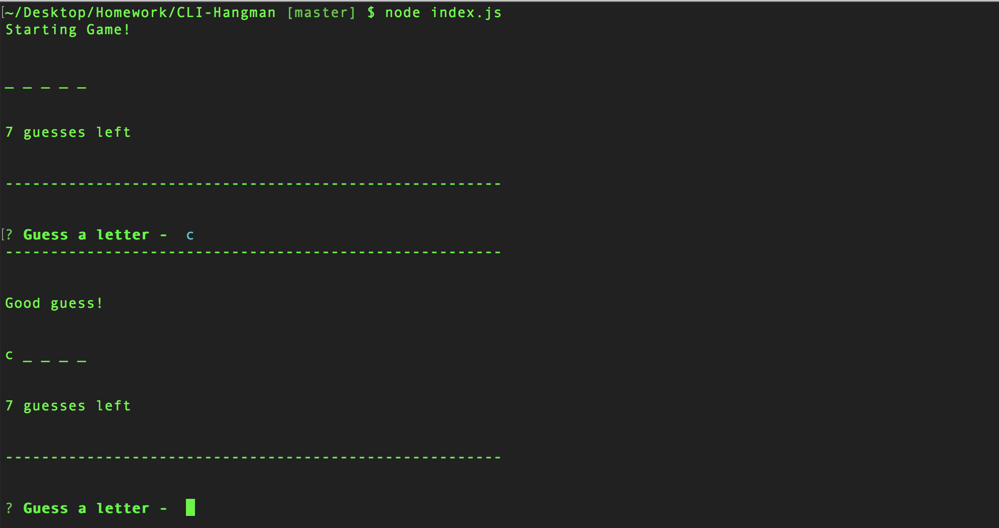

# CLI Hangman

Enjoy the classic game of hangman not in command line form!



# Prerequisites
CLI Hangman requires [node.js](https://nodejs.org/en/) to be installed on your machine and the ability to use [node package manager](https://www.npmjs.com/).

# Installation
CLI Hangman can be installed by downloading this repo, then navigate to your CLI-Hangman directory. Within the directory run `npm install` to download all dependencies.
```
~/.../CLI-Hangman
```
```
npm install
```

# Running CLI Hangman
Now that you have Hangman installed you can run `node index.js` in your command line.

You will be prompted to guess a letter, enter your letter and press the enter key. Repeat until you guess the word or you run out of guesses. Then play again!

# Technology
- Javascript
- [Node.js](https://nodejs.org/en/)
- [Inquirer](https://www.npmjs.com/package/inquirer) - Command Line Prompt

# Challenges
This was an exercise in constructor functions. You can see in this repo that I was working with word.js which contained my Word constructor and letter.js which contained my Letter constructor. At first I found it difficult to understand the relationship between the Word and Letter objects because these objects are not hard coded. I knew they were there but I had a hard time conceptualizing them. One solution that helped was simply calling the object that I was having trouble with, and use it as a visual aid to solve my problem. The other thing I noticed was that the longer I worked on this project and with constructor functions in general, the more I was able to take a invisible set of objects and visualize them in my mind without having to log them to the screen. I look forward to more practice so this becomes second nature to me :)

# Author
Craig Melville
